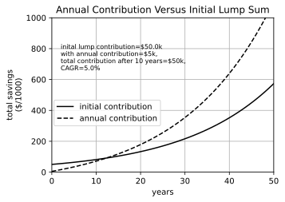
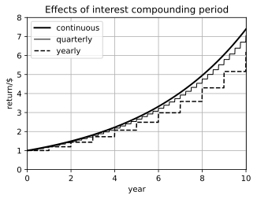
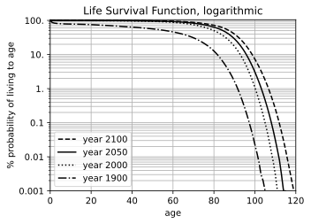
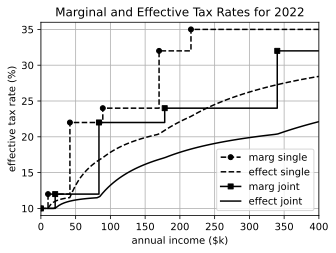
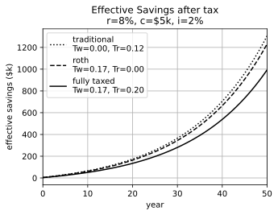
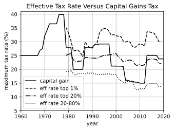

# Finance
Python code to analyze problems in finance

## General comments
This is some code I wrote to help decide if a traditional or Roth IRA is better, as well as play with some other scenarios.

file finance.py has some general purpose functions for calculating financials

calcReturnInit(r,ic,n,i) gives the return after n years of a single initial deposit, ic given the return rate r and inflation i. In its simplest form, this equation is ic*(1+r)^n. r & i can be scalars or arrays to allow them to vary over the n periods. If r & i are arrays, then n must be too.

calcReturnPmt(r,c,n,i=0) gives the return after n years of a single initial deposit, ic, given the return rate r and inflation i. In its simplest form, this equation is c/r*((1+r)^n - 1), one of the Time Value of Money equations. All the parameters can be either scalars or arrays to allow r and i to vary over the n periods. n can also be an array to give cumulative growth.

accumReturn(r,c,ic,i) gives the accumlated return for varying r,c, and i (ic is constant) and returns an array the same size at the parameters. i & c can be scalars if they do not change.

This is a comparison of a single contribution, or annual payments

This graph shows the effects of smaller compounding periods:

The Social Security Administration has data on expected lifetimes that is plotted linearly here. The data is from [https://www.ssa.gov/oact/HistEst/PerLifeTablesHome.html]()

And it is plotted logarithmically here. If you are counting on withdrawals from a stock portfolio to fund retirement income, you probably need to plan on a lifespan of 105 years because an average person is estimated to have a 1% chance of surviving until to that age. An annuity is probably a better option.

This graph shows marginal and effective tax rates for single filers and married filing jointly.

This graph uses function taxedRetirement(r,c,y,i,Tw,Tr) where Tw is the tax rate while working, and Tr is the tax rate during retirement. A traditional IRA or 401k is likely to have more money than a Roth account for the majority of people. A Roth account is only better if the tax rate in retirement is higher than while working.

This graph shows how the tax rates for ordinary income and capital gains have changed during the last few decades. The data for tax rates is from [https://www.cbo.gov/publication/58781](), and the capital gains tax data is from. [https://taxfoundation.org/federal-capital-gains-tax-collections-historical-data/]()

